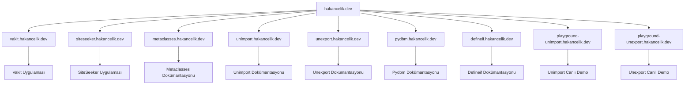

# 🌐 Alt Alanlarım (Subdomains)

Bu sayfada hakancelik.dev ana alanı altındaki tüm alt alanları ve projelerimi bulabilirsiniz.

---

## 🏠 Ana Site

### :octicons-globe-24: Ana Web Sitesi
**URL:** [https://hakancelik.dev](https://hakancelik.dev)  
**Açıklama:** Kişisel web sitem - eğitimler, notlar ve dokümantasyonlar

[:octicons-arrow-right-24: Ziyaret Et](https://hakancelik.dev){ .md-button .md-button--primary }

---

## 🚀 Uygulama Vitrinleri

###  Vakit Uygulaması
**URL:** [https://vakit.hakancelik.dev](https://vakit.hakancelik.dev)  
**Proje:** [vakit](https://github.com/hakancelikdev/vakit)  
**Açıklama:** Vakit uygulamasının canlı vitrini

[:octicons-arrow-right-24: Ziyaret Et](https://vakit.hakancelik.dev){ .md-button .md-button--small }

###  SiteSeeker Uygulaması
**URL:** [https://siteseeker.hakancelik.dev](https://siteseeker.hakancelik.dev)  
**Proje:** [siteseeker](https://github.com/hakancelikdev/siteseeker)  
**Açıklama:** SiteSeeker uygulamasının canlı vitrini

[:octicons-arrow-right-24: Ziyaret Et](https://siteseeker.hakancelik.dev){ .md-button .md-button--small }

---

## 📚 Dokümantasyonlar

### :octicons-book-24: Python Metaclasses Dokümantasyonu
**URL:** [https://metaclasses.hakancelik.dev](https://metaclasses.hakancelik.dev)  
**Proje:** [metaclasses](https://github.com/hakancelikdev/metaclasses)  
**Açıklama:** Python'da metaclasses hakkında detaylı dokümantasyon

[:octicons-arrow-right-24: Ziyaret Et](https://metaclasses.hakancelik.dev){ .md-button .md-button--small }

### :octicons-book-24: Unimport Dokümantasyonu
**URL:** [https://unimport.hakancelik.dev](https://unimport.hakancelik.dev)  
**Proje:** [unimport](https://github.com/hakancelikdev/unimport)  
**Açıklama:** Unimport projesi hakkında detaylı dokümantasyon

[:octicons-arrow-right-24: Ziyaret Et](https://unimport.hakancelik.dev){ .md-button .md-button--small }

### :octicons-book-24: Unexport Dokümantasyonu
**URL:** [https://unexport.hakancelik.dev](https://unexport.hakancelik.dev)  
**Proje:** [unexport](https://github.com/hakancelikdev/unexport)  
**Açıklama:** Unexport projesi hakkında detaylı dokümantasyon

[:octicons-arrow-right-24: Ziyaret Et](https://unexport.hakancelik.dev){ .md-button .md-button--small }

### :octicons-book-24: Pydbm Dokümantasyonu
**URL:** [https://pydbm.hakancelik.dev](https://pydbm.hakancelik.dev)  
**Proje:** [pydbm](https://github.com/hakancelikdev/pydbm)  
**Açıklama:** Pydbm projesi hakkında detaylı dokümantasyon

[:octicons-arrow-right-24: Ziyaret Et](https://pydbm.hakancelik.dev){ .md-button .md-button--small }

### :octicons-book-24: Defineif Dokümantasyonu
**URL:** [https://defineif.hakancelik.dev](https://defineif.hakancelik.dev)  
**Proje:** [defineif](https://github.com/hakancelikdev/definif)  
**Açıklama:** Defineif projesi hakkında detaylı dokümantasyon

[:octicons-arrow-right-24: Ziyaret Et](https://defineif.hakancelik.dev){ .md-button .md-button--small }

---

## 🎮 Canlı Demo'lar

### :octicons-play-24: Unimport Playground
**URL:** [https://playground-unimport.hakancelik.dev](https://playground-unimport.hakancelik.dev)  
**Proje:** [unimport](https://github.com/hakancelikdev/unimport)  
**Açıklama:** Unimport'u tarayıcınızda canlı olarak deneyebilirsiniz

[:octicons-arrow-right-24: Deneyin](https://playground-unimport.hakancelik.dev){ .md-button .md-button--small }

### :octicons-play-24: Unexport Playground
**URL:** [https://playground-unexport.hakancelik.dev](https://playground-unexport.hakancelik.dev)  
**Proje:** [unexport](https://github.com/hakancelikdev/unexport)  
**Açıklama:** Unexport'u tarayıcınızda canlı olarak deneyebilirsiniz

[:octicons-arrow-right-24: Deneyin](https://playground-unexport.hakancelik.dev){ .md-button .md-button--small }

---

## 📊 Site Haritası

Aşağıdaki diyagram tüm alt alanlarımı görsel olarak gösterir:

---

## 🔗 Hızlı Erişim

### :octicons-repo-24: GitHub Profilim
**URL:** [https://github.com/hakancelikdev](https://github.com/hakancelikdev)  
**Açıklama:** Tüm projelerimi GitHub'da bulabilirsiniz

[:octicons-arrow-right-24: GitHub'a Git](https://github.com/hakancelikdev){ .md-button .md-button--small }

### :octicons-mail-24: İletişim
**E-posta:** [hakancelikdev@gmail.com](mailto:hakancelikdev@gmail.com)  
**Açıklama:** Sorularınız için benimle iletişime geçebilirsiniz

[:octicons-arrow-right-24: E-posta Gönder](mailto:hakancelikdev@gmail.com){ .md-button .md-button--small }

